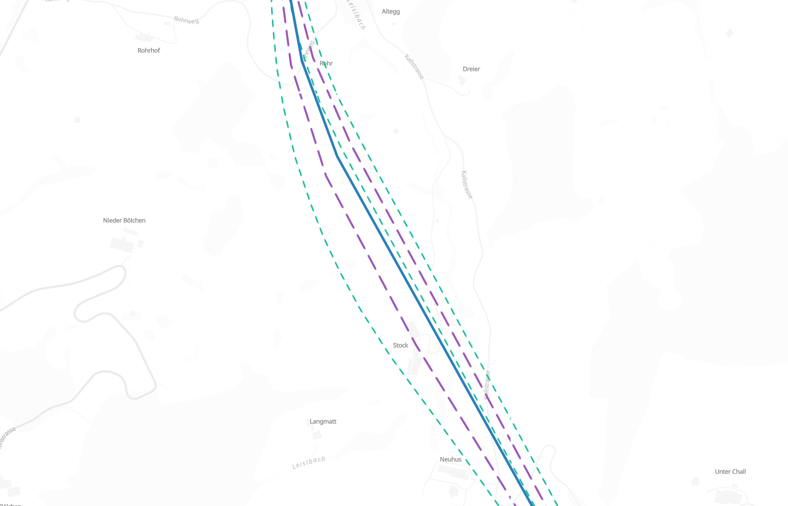

# magnetron
Collapse carriageways by making them magnetic

When rendering roads with multiple [carriageways](https://en.wikipedia.org/wiki/Carriageway) at low zoom levels, for example at zoom 7 in MapLibre GL JS, one cannot visually separate the individual carriageways. They are too close together at that scale. But by default, [Planetiler](https://github.com/onthegomap/planetiler) and other vector tile generators will still include two lines for dual carriageways at all zoom levels. This increases tile size and leads to more work for the frontend rendering engine without having any cartographic benefit.

The idea of magnetron is to collapse carriageways by introducing an attractive force between lines. The algorithm roughly looks like this:

- For every point of a line: 
  - Find the closest point of a neighboring line. Only search up to a certain distance.
  - If a closest neighbor was found, compute the midpoint between the current point and the neighbor and add this midpoint to a new line.
  - Else add the current point to the new line.

Repeat this multiple times. For example, repeat twice to first collapse triple to dual, then dual to single carriageways.

The name is inspired by https://github.com/migurski/Skeletron.

## Demo

https://wipfli.github.io/magnetron/

<a href="https://wipfli.github.io/magnetron/"></a>
<i>Demo of collapsed carriageways in Hauensteintunnel. The original geometry is shown by green short dashed lines. There are initially 3 parallel carriageways. After one iteration, 2 parallel lines are left shown in purple with long dashes. After a second iteration, the two purple dashed lines are collapsed into a single solid blue line.</i>

## Usage

Put some linestrings in a geojson file called `data/input.geojson`.

Download the planetiler jar with:

```
wget https://github.com/onthegomap/planetiler/releases/latest/download/planetiler.jar
```

Then execute:

```
./run.sh
```

and open your browser console at http://localhost:3000/

## Requirements

Java 21, tippecanoe, python3, npx

## License

Apache 2.0 for the code. Demo uses OpenStreetMap data ODbL.
